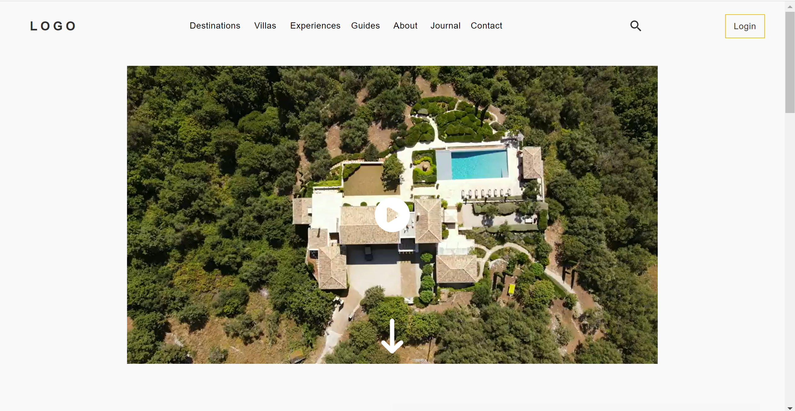
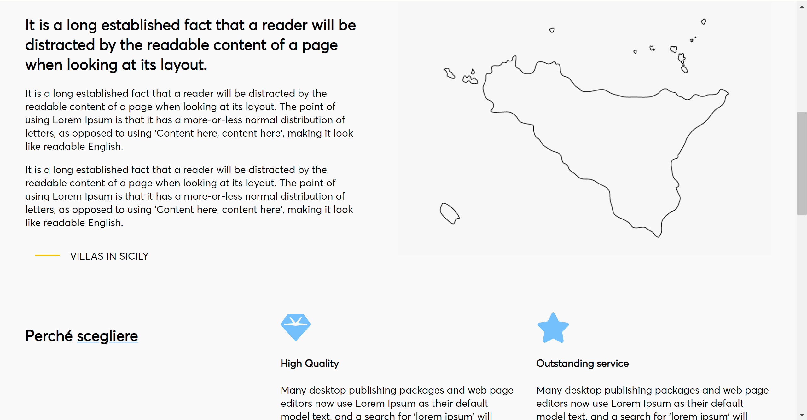
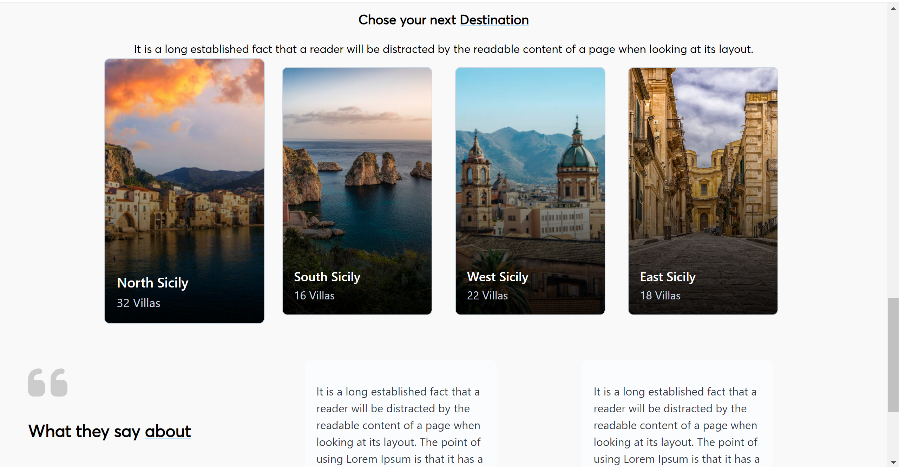
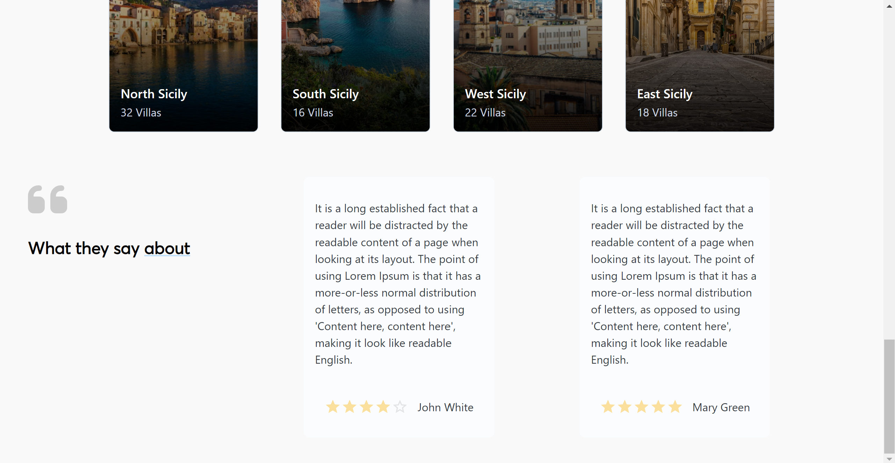
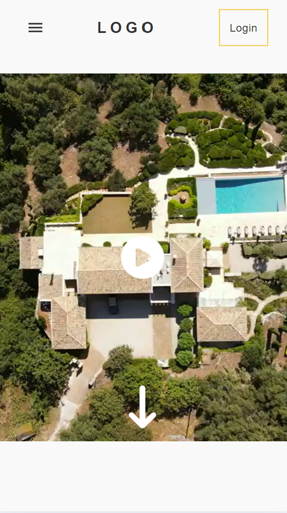
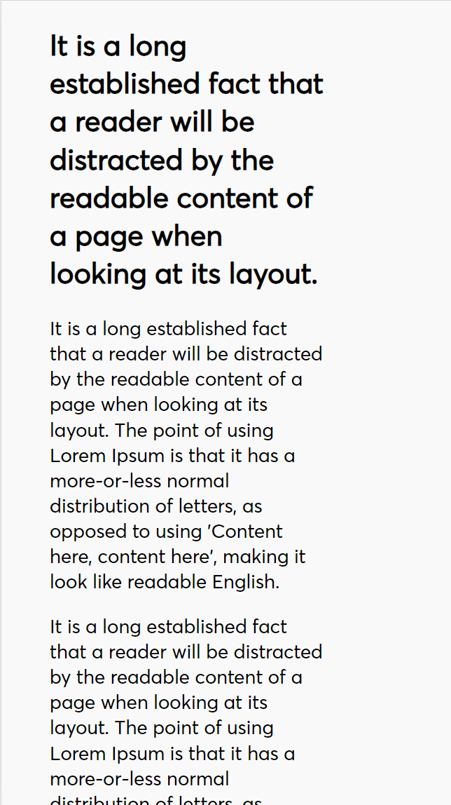
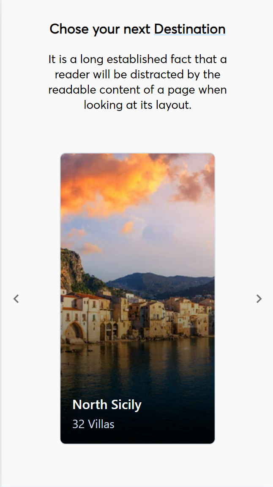
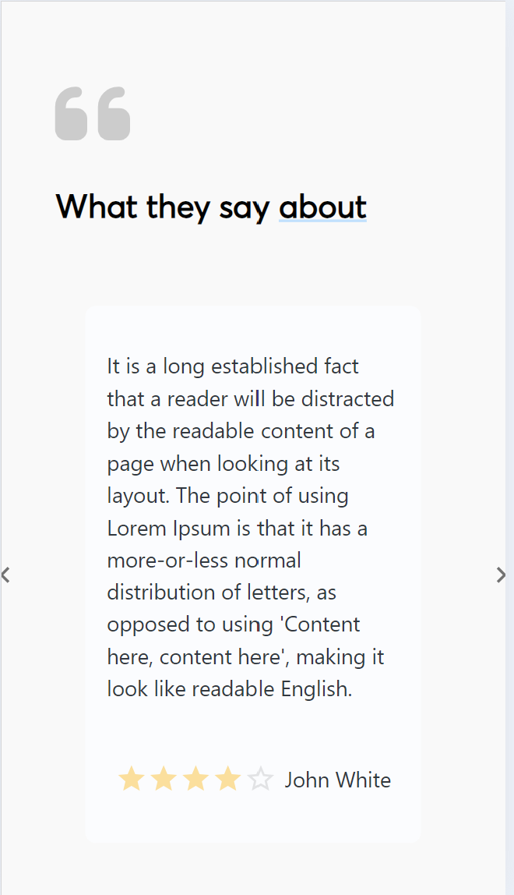

# About the Project 🌅

A landing page of a website to find villas based in Sicily.

## Screenshots 📷

## Desktop version 💻
   

## Mobile version 📱
    

## Technologies Used ⚛️ 

React v18.2.0
TypeScript
Vite

## Starting the Project 📋

In the project directory, you can run:
### `npm run dev`
Runs the app in the development mode.\
Open [http://localhost:3000](http://localhost:3000) to view it in your browser.
